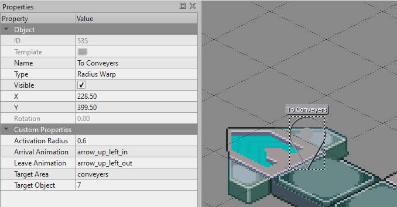
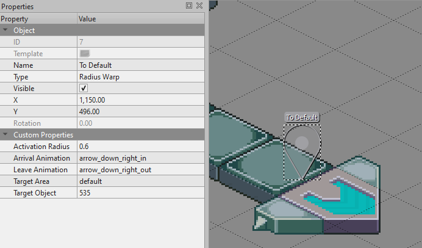

Automatically adds landings locations for server warps to your server, also handles arrival / leaving animations

Requirements:
- Delay lib https://github.com/Keristero/gravy-yum/blob/main/scripts/libs/delay.lua
- assets/landings https://github.com/Keristero/gravy-yum/tree/main/assets/landings

Supported warp types:
- Server Warp
    - supports arrival animations
- Custom Warp
    - supports arrival animations
- Interact Warp
    - (a warp activated by interaction)
    - supports arrival animations
    - supports landing animations
- Radius Warp
    - (a warp activated by entering its radius)
    - supports arrival animations
    - supports landing animations

Supported warp custom properties:
- "Incoming Data" (string) secret to share with the server that is linking to you; for their "Data"
- "Warp In" (boolean) should the warp in animation be shown (laser from sky)
- "Warp Out" (boolean) should the warp out animation be shown (laser from sky)
- "Arrival Animation" (string) name of special animation which should play on warp in
- "Leave Animation" (string) name of special animation to play on warp out
- "Dont Teleport" (boolean) add this property if you just want the warp to animate, no teleporting

custom properties for warping to another server:
- "Target Area" (string) name of area you want to transfer to, (same as filename, minus the .tmx)
- "Target Object" (string/object) id of object you want to teleport to

custom properties for warping to another map:
- "Target Area" (string) name of area you want to transfer to, (same as filename, minus the .tmx)
- "Target Object" (string/object) id of object you want to teleport to

Radius Warp only:
- "Activation Radius" (float) the warp will activate when a player enters this radius

Special Animations (for arrival / leave animation):
- fall_in
- lev_beast_in
- lev_beast_out

## Usage Examples

### Making "Arrow Warps" using Radius Warp
Arrow A

Arrow B

More special animations can be added by requiring them in main.lua -> special_animations